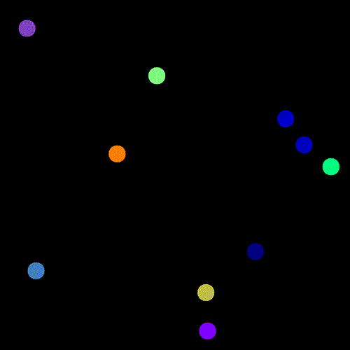

# Simple Tracker Simulator Exercises 🚀

This is a simple developer exercise that currently features two classes:

- **Generator Class**: Generates small moving bodies ⚙️.
- **Detector Class (in progress)**: Associates detections over time 🔍.



## Generator Setup

In this first release, several parameters of the body generator can be modified both inside the source code and in real time. Use the following keys to interact with the animation loop:

| Key     | Action                                      |
|---------|---------------------------------------------|
| `ESC`, `q`, `Q` | Stop the simulation and exit.               |
| `W`     | Increase the width (`W`) of the frame by 100. |
| `w`     | Decrease the width (`W`) of the frame by 100. |
| `H`     | Increase the height (`H`) of the frame by 100. |
| `h`     | Decrease the height (`H`) of the frame by 100. |
| `R`     | Increase the radius (`r`) of the bodies by 1. |
| `r`     | Decrease the radius (`r`) of the bodies by 1. |
| `+`     | Increase the global speed factor.            |
| `-`     | Decrease the global speed factor.            |
| `d`, `D` | Toggle the detector on or off.               |

## Detector Class Status

Currently, the detector class only takes distances into account when making associations. However, this method results in incorrect associations, especially when trajectories cross. The detector can misidentify which body belongs to which track, particularly in scenarios with overlapping or close-moving objects.

We invite any contributors or readers to help improve the algorithm to better account for velocities and movement patterns 🏃‍♂️💨, which would lead to more accurate and reliable associations over time.

If you have ideas on how to improve the detection process or wish to collaborate on enhancing this functionality, feel free to reach out or submit a pull request! 💡🤝

## How to Compile

Compiling the project is straightforward! Just follow these simple steps:

   ```bash
   mkdir build
   cd build
   cmake ..
   make
   ```
Once compiled, you can run the simulator using:
   ```bash
   ./sim
   ```
Enjoy simulating! 🚀

## How to Record Your Own Demo

Want to capture your own simulation? It's easy! Just add the following code inside the main loop to save each frame as an image file:

```cpp
std::ostringstream ss;
ss << "FRAME" << std::setw(6) << std::setfill('0') << nframe << ".png";
std::string filename = ss.str();
std::cout << filename << std::endl;
cv::imwrite(filename,frame);
```

This will save each frame with filenames like `FRAME000001.png`, `FRAME000002.png`, etc.

After that, you can use `ffmpeg` to create a GIF animation from the saved frames. Here's an example of how to do it:

```bash
ffmpeg -framerate 90 -i FRAME%06d.png -vf "fps=30,scale=500:-1:flags=lanczos" -loop 0 output.gif
```

This command takes all the PNG images, processes them at 30 frames per second, scales them to a width of 500px, and creates an infinite loop GIF. You can adjust the frame rate and resolution to your liking.

So next time you want to record a demo, just remember to add those few lines, and voilà! 🎥🎬

